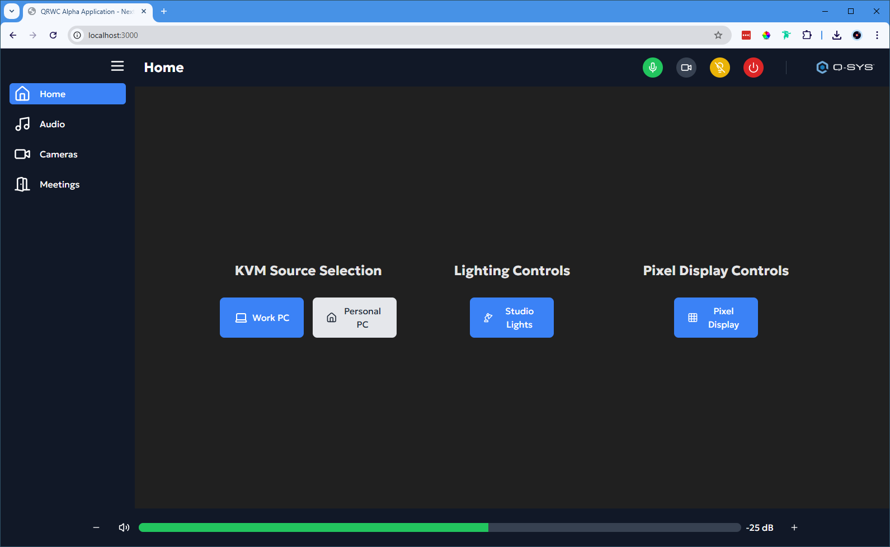
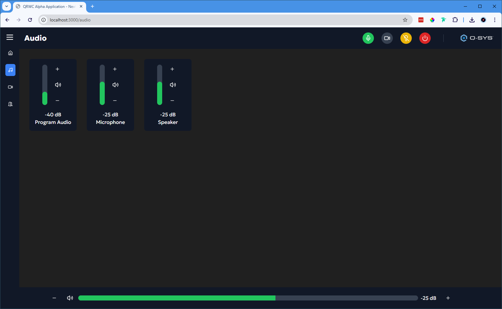
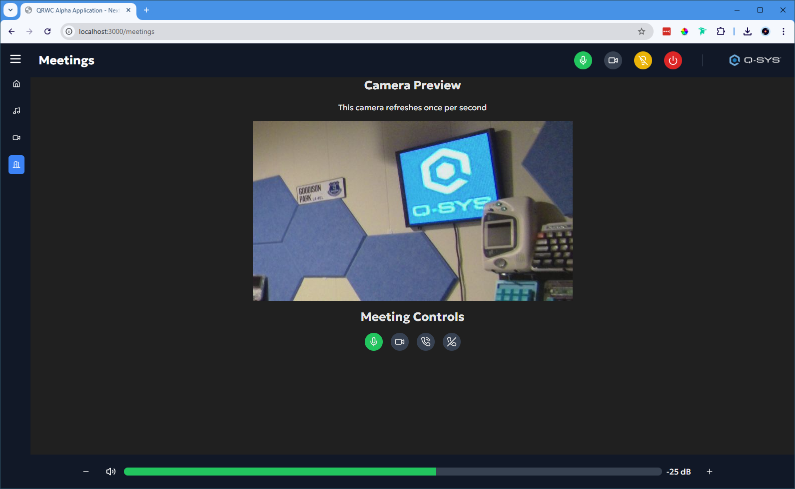

# Welcome to a QRWC demo featuring Next.JS

This is a [Next.js](https://nextjs.org) project bootstrapped with [`create-next-app`](https://nextjs.org/docs/app/api-reference/cli/create-next-app).

## Getting Started

To Deploy this app:

1. Locate "qrwc-demo.qsys" and configure and load the file to a core. The default core is a core nano.

    - ***This demo is using the QRWC npm module, version 0.3.0-alpha. Please contact an admin at Developers.QSC.com for access***

2. Open the project in VSCode and create a file in the root directory named '.env.local'
    - Environment file should contain = NEXT_PUBLIC_QSYS_IP='{core-ip}'
    - Open this file and replace the default IP with the IP of your Q-SYS Core

3. Run the development server:

```bash
# Install required dependencies
npm i
# or
pnpm i

# Install Q-SYS qrwc module
npm i @q-sys/qrwc
# or
pnpm add @q-sys/qrwc

# Start development server
npm run dev
# or
pnpm dev
```

Open [http://localhost:3000](http://localhost:3000) with your browser to see the result.

## Learn More

To learn more about QRWC, please visit developers.qsys.com

To learn more about Next.js, take a look at the following resources:

- [Next.js Documentation](https://nextjs.org/docs) - learn about Next.js features and API.
- [Learn Next.js](https://nextjs.org/learn) - an interactive Next.js tutorial.

You can check out [the Next.js GitHub repository](https://github.com/vercel/next.js) - your feedback and contributions are welcome!

## Screenshots








## MIT License

Copyright 2025 QSC, LLC

Permission is hereby granted, free of charge, to any person obtaining a copy of this software and associated documentation files (the “Software”), to deal in the Software without restriction, including without limitation the rights to use, copy, modify, merge, publish, distribute, sublicense, and/or sell copies of the Software, and to permit persons to whom the Software is furnished to do so, subject to the following conditions:

The above copyright notice and this permission notice shall be included in all copies or substantial portions of the Software.

THE SOFTWARE IS PROVIDED “AS IS”, WITHOUT WARRANTY OF ANY KIND, EXPRESS OR IMPLIED, INCLUDING BUT NOT LIMITED TO THE WARRANTIES OF MERCHANTABILITY, FITNESS FOR A PARTICULAR PURPOSE AND NONINFRINGEMENT. IN NO EVENT SHALL THE AUTHORS OR COPYRIGHT HOLDERS BE LIABLE FOR ANY CLAIM, DAMAGES OR OTHER LIABILITY, WHETHER IN AN ACTION OF CONTRACT, TORT OR OTHERWISE, ARISING FROM, OUT OF OR IN CONNECTION WITH THE SOFTWARE OR THE USE OR OTHER DEALINGS IN THE SOFTWARE.
